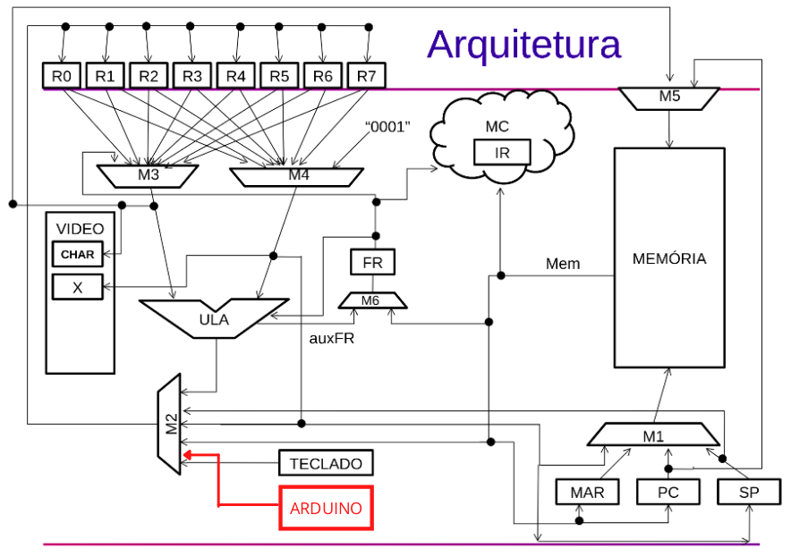
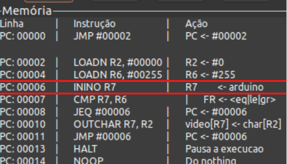
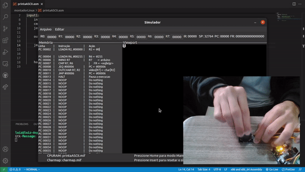

# Type The Game Assembly

Repositório do Projeto da Disciplina de [Prática em Organização e Arquitetura de Computadores](https://uspdigital.usp.br/jupiterweb/obterDisciplina?sgldis=SSC0119) ministrada pelo professor Eduardo Simões.

## Item 1 - Implementação do Jogo

TODO: Descrição

## Itens 2 e 3 - Construção do Hardware do Processador

### Hardware Construído

O hardware do processador foi construído em Linguagem C. A simulação da execução de um programa nessa arquitetura se dá conforme o arquivo [simpleSimulator.c](./simpleSimulator.c), tendo como base o simpleSimulator implementado durante as aulas.

### Proposta de Modificação  

Como proposta de modificação, foi adicionada uma nova instrução chamada `inino`, que, em suma, lê um valor reproduzido por um Arduino conectado a uma porta USB (como se fosse um teclado) e o armazena em um registrador rx.


O OPCODE dessa nova instrução foi definido como `110110`, i.e., `54`. Um novo sinal de controle chamado `sARDUINO` foi criado para determinar uma entrada extra para o `mux2`. Assim, nas diretivas de pré-processamento foram definidos:

```c
    #define sARDUINO 5  // novo sinal de controle para o mux2
    #define ININO 54    // opcode decimal da operação inino
```

Já dentro da função `main`, uma nova variável foi criada a fim de armazenar o valor lido do arduino:

```c
    int ARDUINO = 0;
```

Para a decodificação da `inino`, foi adicionado um novo case:

```c
    switch(opcode) {
        ...
        case ININO:
            if (kbhit()) // se há um caractere não processado na entrada padrão
                ARDUINO = getchar(); // esse caractere é lido e colocado em ARDUINO
            else 
                ARDUINO = 255; // se não, ARDUINO armazena 255 (valor representando "não houve entrada")
            ARDUINO = pega_pedaco(ARDUINO, 7, 0); // pegando o valor armazenado por ARDUINO % 256
            selM2 = sARDUINO; // determinando a seleção do mux2 para que ele receba entrada do arduino
            LoadReg[rx] = 1; // inicializando o registrador rx com 1 para que ele possa receber a saída do mux2 
            state = STATE_FETCH; // estado de busca
            break;
        ...
    }
```

Na seleção da entrada do `mux2`, foi adicionado a seguinte verificação:

```c
    ...
    else if (selM2 == sARDUINO) { 
        M2 = ARDUINO;
    }
    ...
```

O desenho da arquitetura pode ser acompanhado a seguir:



## Item 4 - Teste do Novo Hardware

### Arquivo Montador

Para testar a nova instrução, foram feitas algumas alterações no código do montador, adicionando as informações da `inino`, além de uma referência interna no código, que foi definida pelo valor `98`. Dessa forma, no arquivo `defs.h`, foram adicionadas algumas diretivas:

```c
    #define ININO "110110" // opcode da inino
    #define ININO_CODE 98  // referência interna da inino
    #define ININO_STR "ININO" // nome da inino no código .asm
```

Foi adicionado um case para pular a declaração da instrução:

```c
    switch (op_code) {
        ...
        case ININO_CODE:
        ...
    }
```

Bem como um case para a escrita da instrução em binário:

```c
    switch (op_code) {
        ...
        case ININO_CODE:
            str_tmp1 = parser_GetItem_s(); // obtendo o nome do registrador da instrução
            val1 = BuscaRegistrador(str_tmp1); // convertendo o número do registrador para inteiro
            free(str_tmp1); // liberando buffer
            str_tmp1 = ConverteRegistrador(val1); // obtendo o número do registrador como string de 3 chars 
            sprintf(str_msg,"%s%s0000000",ININO,str_tmp1); // concatenando OPCODE + str do número do registrador + 00..0 em str_msg
            free(str_tmp1); // liberando buffer
            parser_Write_Inst(str_msg,end_cnt); // escrevendo str_msg no arquivo
            end_cnt += 1; // endereço += 1 (a próxima instrução está na linha de baixo)
            break;
        ...
    }

```

E também um case para quando o nome da instrução for lido:

```c
    ...
    else if (strcmp(str_tmp, ININO_STR)) { // se ler um "ININO" no .asm
        return ININO_CODE; // retorna a referência interna da inino
    }
    ...
```

### Execução no Simulador

Para o diálogo do arduino com o processador, foi desenvolvido um sketch para ler valores analógicos de um mini joystick e escrever seus indicadores correspondentes na entrada padrão. Em síntese, o programa carregado no arduino tem o seguinte comportamento:

Valor lido do joystick | Valor escrito na entrada padrão
:---------------------: | :-----------------------------:
MAX_EIXO_X       | 'R' (right)
MIN_EIXO_X       | 'L' (left)
MAX_EIXO_Y       | 'U' (up)
MIN_EIXO_Y       | 'D' (down)

Com o proósito de teste, um código simples em assembly foi elaborado para ler esses valores do arduino através da instrução inino. Sua representação no simulador:



A saída do simulador se deu conforme a imagem abaixo:



Tendo a nova instrução implementada e funcionando, podemos adaptar jogos já feitos, retirando as instruções `inchar`s, substituindo-as por instruções `inino`s. Como resultado, podemos jogar com joystick:


